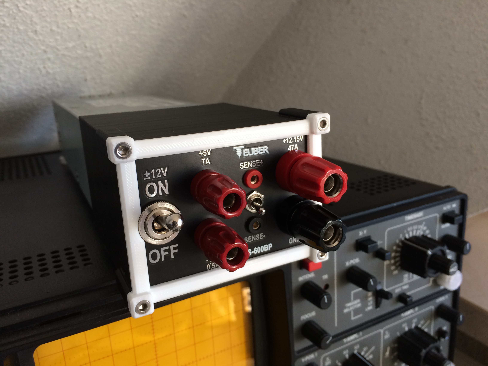

# DPS-600PB Lab Bench Power Supply

This project contains some useful data to create an high current lab bench power supply from an DPS-600PB server supply. 
The finished supply looks something like this:

## Getting Started

> :warning: **High voltage can kill you**: Do not tinker with electrical stuff unless you know exactly what you are doing!

> :warning: **Don't connect the mains cable while working on the circuit**: Be very careful here!

### Bill of tools

* soldering iron
* 3d printer
* basic tools (e.g. screw driver)

### Prerequisites/Bill of Material

| Name                                                 | DIY/BUY | Count           |
| -------------                                        |:-------------:|:-------------:|
| PKNI 10B RT (Polklemme, 4 mm, M6, rot)               | BUY | 1 |
| PKNI 10B SW (Polklemme, 4 mm, M6, schwarz)           | BUY | 1 |
| PK 10 A RT (Polklemme, 4 mm, rot)                    | BUY | 2 |
| HS 636 H2 (Hebelschalter, 10(4)A-400VAC, 1x Ein-Ein) | BUY | 1 |
| M3x10mm hex screw                                    | BUY | 4 |
| 3d printed case                                      | DIY | 1 |
| a few pieces of small signal cable                   | BUY | - |
| large diameter cable for high current connection     | BUY | ? |
| cable lugs that fits the high current cable          | BUY | 4 |

## Authors

* **Julian Teuber**
